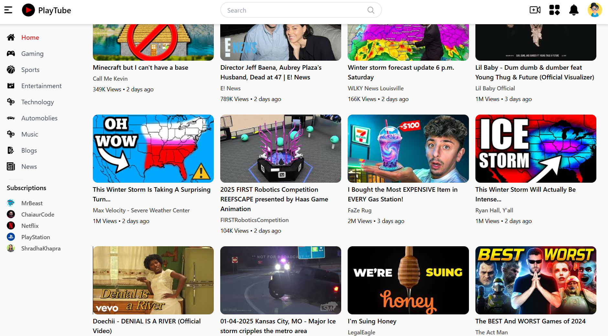

# PlayTube 🎥

A minimalist YouTube-like clone built with **React.js** and **Tailwind CSS**, leveraging the official **YouTube API**. It allows users to view videos and filter them by categories, offering a clean and functional user experience.

## 🔗 Live Preview

Check out the live demo here: [PlayTube Demo](https://playtube-eta.vercel.app/)


## 📌 Features

- View videos from YouTube.
- Filter videos based on categories.
- Responsive and modern UI with Tailwind CSS.
- Seamless integration with the YouTube API.


## 🛠️ Built With

- **React.js**: Frontend framework for building user interfaces.
- **Tailwind CSS**: Utility-first CSS framework for styling.
- **YouTube API**: To fetch and display videos dynamically.


## 🚀 Installation and Setup

1. Clone the repository:
   ```bash
   git clone https://github.com/SyedShahulAhmed/PlayTube.git
   ```

2. Navigate to the project directory:
   ```bash
   cd PlayTube
   ```

3. Install dependencies:
   ```bash
   npm install
   ```

4. Add your **YouTube API Key** in the `.env` file:
   ```bash
   REACT_APP_YOUTUBE_API_KEY = your_api_key_here
   ```

5. Start the development server:
   ```bash
   npm run dev
   ```

6. Open your browser and visit:
   ```text
   http://localhost:3000
   ```

---

## 🌟 Preview



---

## 🤝 Contributing

Contributions, issues, and feature requests are welcome!  
